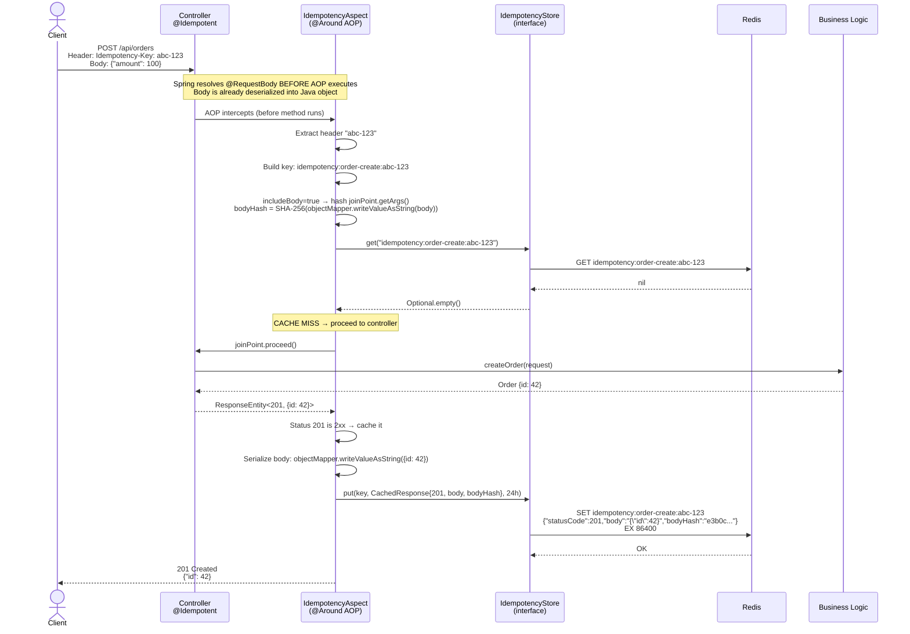
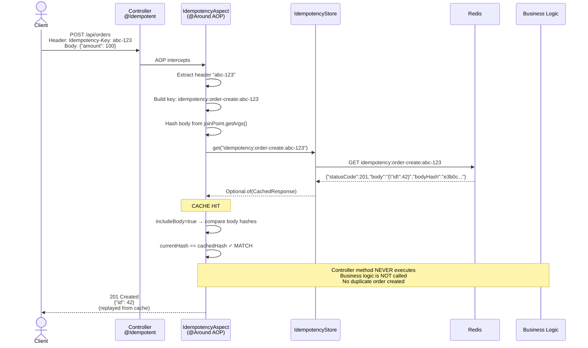
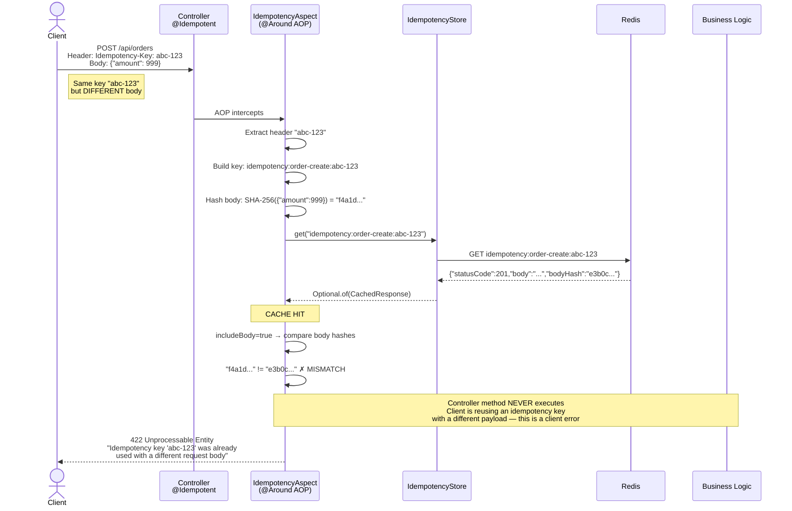
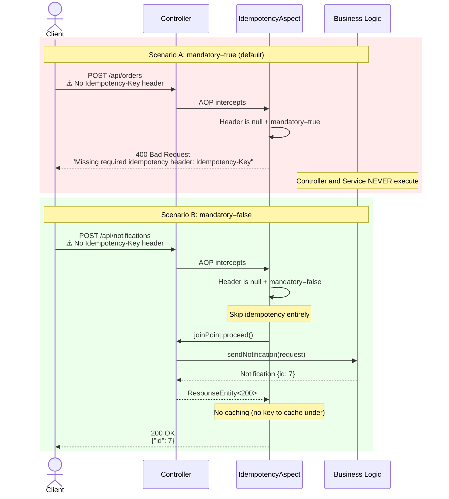
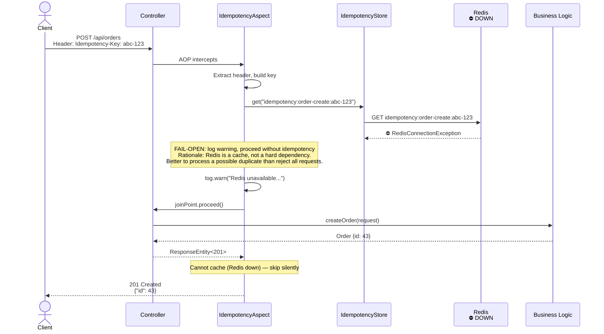
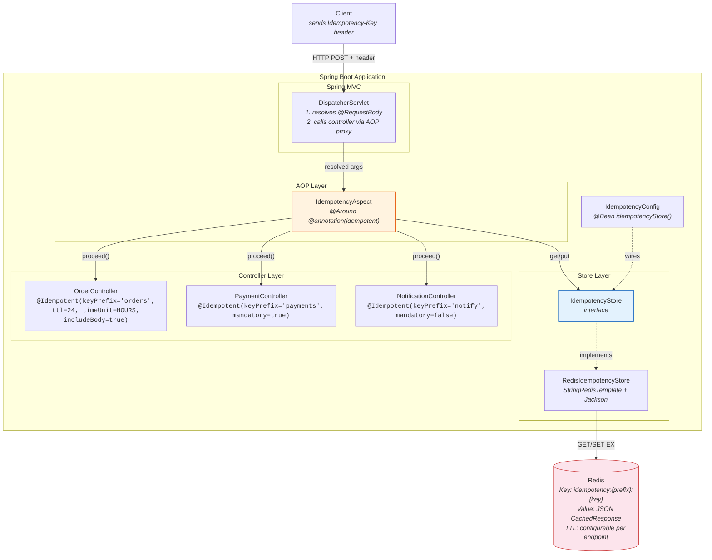

# Idempotency Flow Diagrams

## 1. Cache Miss (First Request)



## 2. Cache Hit (Duplicate Request — Same Body)



## 3. Body Mismatch (Same Key, Different Body → 422)



## 4. Missing Header — Mandatory vs Optional



## 5. Redis Unavailable (Fail-Open)



## 6. Complete Component Architecture



## 7. Redis Key Structure

```mermaid
flowchart LR
    subgraph Key Format
        direction LR
        P["idempotency"] --- Sep1[":"] --- Prefix["keyPrefix"] --- Sep2[":"] --- Header["headerValue"]
    end

    subgraph Examples
        E1["idempotency:order-create:abc-123"]
        E2["idempotency:payments:pay-xyz-789"]
        E3["idempotency::no-prefix-key"]
    end

    subgraph Value["Value (JSON)"]
        V1["{<br/>  statusCode: 201,<br/>  body: '{\"id\":42}',<br/>  bodyHash: 'e3b0c...' or null<br/>}"]
    end

    subgraph TTL
        T1["Configurable per @Idempotent<br/>Default: 1 HOUR<br/>Example: @Idempotent(ttl=24, timeUnit=HOURS)"]
    end

    Key_Format --> Examples
    Examples --> Value
    Value --> TTL

    style P fill:#e8f5e9
    style Prefix fill:#fff3e0
    style Header fill:#e3f2fd
```
