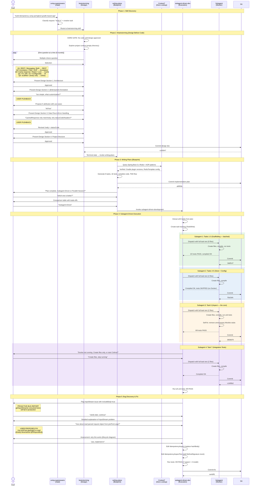
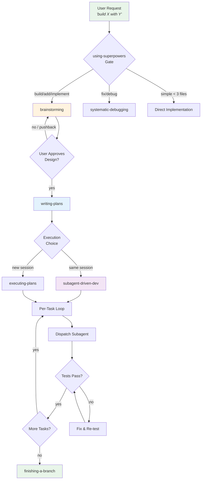
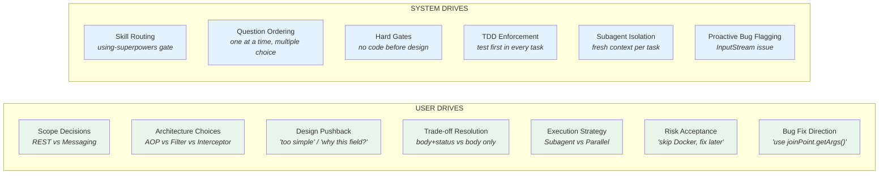
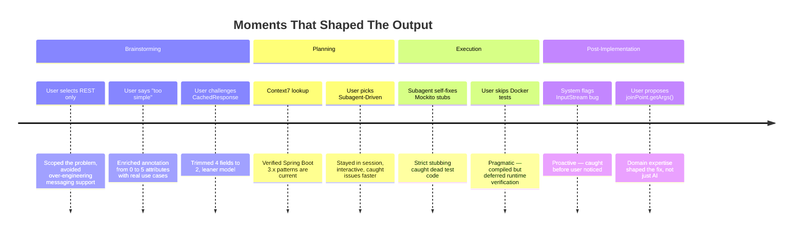

# Superpowers Interaction Sequence Diagram

## Full Session Flow

## Interaction Pattern Summary

## Where User Interaction Happens

## Quick Reference: How to Trigger This Flow

| What You Say | What Fires | What Happens |
|---|---|---|
| "build X" / "create Y" / "implement Z" | brainstorming → writing-plans → subagent-driven | Full design-first flow |
| "fix this bug" / "why is X broken" | systematic-debugging | Debug-first flow |
| "add a field to X" (trivial) | Nothing — direct edit | Too small for skills |
| "refactor the auth system" | brainstorming → writing-plans → subagent-driven | Full flow (multi-file) |

## Key Triggers That Shaped Quality

